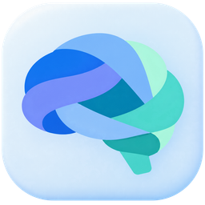

# Brain for Mac and Windows

Record the conversation. Keep the useful details.

Brain brings your meetings, notes, and next steps together on your Mac or
Windows PC. See the actual app, including its meeting assistant, on the
[Brain website](https://samishariff.github.io/Brain/).

**Brain for Mac is available now** — download it from the
[Mac page](https://samishariff.github.io/Brain/mac.html)
(macOS 26 or later, Apple silicon). The Mac app is a signed, notarized disk
image; the installed app updates itself from the public release channel.

**Brain for Windows preview 1.0.3.14 is available** from the [Brain website](https://samishariff.github.io/Brain/). Read the [preview notes](https://samishariff.github.io/Brain/release-notes.html) before installing. Physical microphones, live calls, device changes and sleep/wake behavior remain unverified for this preview.

- [Mac setup](https://samishariff.github.io/Brain/mac.html)
- [Getting started on Windows](https://samishariff.github.io/Brain/help.html)
- [Your privacy](https://samishariff.github.io/Brain/privacy.html)
- [What is included and still being checked](https://samishariff.github.io/Brain/release-notes.html)

The screenshots show the real apps with fictional meeting content. Speech and
summary tools can run on your own computer; optional online services are your
choice. Google and Microsoft calendar sign-in is still being prepared.

This public repository holds the website, approved images, public release
information, and third-party notices. Brain's application source and signing
keys stay private. Release files are hosted in the
[public release channel](https://github.com/samishariff/Brain-Windows-Releases/releases),
which installed copies of Brain check for updates.

If Sami has already shared an earlier preview with you, keep your existing copy and backups until you have checked your imported work. Physical microphones, live calls, device changes and sleep/wake behavior remain unverified. For help, contact Sami through your usual private channel.

Keep recordings, meeting text, account details, passwords, and diagnostic reports
out of public posts.

Third-party software notices are in [THIRD_PARTY_NOTICES.md](THIRD_PARTY_NOTICES.md).
The website's Manrope font is distributed with its [open-font licence](assets/Manrope-OFL.txt).

## Optional Microsoft Store download

The homepage has a disabled Store option beside the Windows installer download.
In `index.html`, `windows-store-option` has the reserved Store product ID
`9NTQ8V2MMQP1` for **Brain Meeting Memory** and `data-approved="false"`.
The public listing and deep link are not live. Keep approval false until the
listing is approved and publicly available. The option stays hidden and has no
link while disabled; the existing Windows installer and Mac downloads remain available.

Before enabling it, verify the [12-character alphanumeric Store ID](https://apps.microsoft.com/badge)
from Partner Center's Product identity page and the exact public listing, and
update the Windows help page for Store installation and updates. The current
help describes the direct installer.
Confirm that `data-product-id` matches that listing, then set `data-approved="true"`.
The script accepts that ID format, constructs the Microsoft listing URL and
shows the second download option. Invalid or empty IDs stay hidden even when
approval is set. Set approval back to `false` to hide it again. This configuration
changes the website only; it does not configure app updates or migrate installations.

The existing HTML/CSS/SVG link check covers the current direct downloads and
local files. It does not validate the Store URL generated by JavaScript; verify
the actual approved listing and add its exact URL to release validation before
activating the option. The reserved product ID alone does not activate a Store link.
